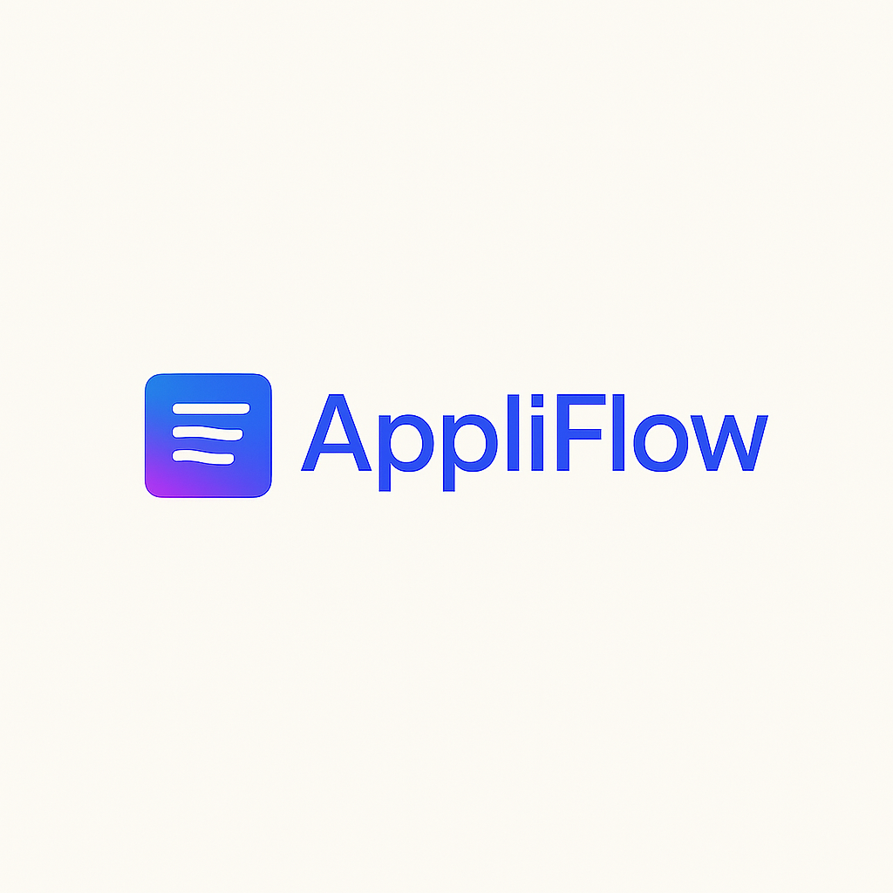

# AppliFlow 🚀  
*Your AI-powered assistant for streamlined, customized job applications.*

## ✨ What is AppliFlow?

**AppliFlow** is a Chrome extension and companion web app designed to make job applications fast, smart, and effortless. With Gemini AI, Google Docs integration, and ATS optimization tools, AppliFlow helps you tailor resumes and cover letters directly to job descriptions—no copy-paste chaos, no formatting headaches.

---

## ⚙️ Features

### 🔹 Chrome Extension
- 📎 Upload and scan resumes, cover letters, and job descriptions
- 💡 Smart suggestions for resume improvements and tailored cover letters
- 🔁 Persistent AI session per job until manually reset
- 📋 Copy-paste ready Workday experience entries
- 🧾 Auto-formatted date ranges for application portals
- 📄 Drag and drop PDF/Word files directly into job applications
- ✨ Aesthetic, Gemini-inspired UI

### 🔹 Website Dashboard
- 🔐 Google login + Drive integration
- 💾 Save resume/cover letter versions in Drive
- 📊 Set preferences for resume tone, job type, industry
- 📈 ATS Optimization Score
- 📚 Job Tracker Panel
- 🧠 Impact Statement Generator

---

## 🧠 Tech Stack

| Area              | Tech Used                   |
|-------------------|-----------------------------|
| Frontend (Web)    | Next.js, Tailwind CSS       |
| Chrome Extension  | TypeScript, React           |
| AI Engine         | Gemini Pro API              |
| Auth & Storage    | Firebase Auth, Google Drive |
| Backend (Optional)| Firebase Functions or Express.js |

---

## 🗂️ Folder Structure (Monorepo)
appliflow/
├── chrome-extension/
│   └── README.md  ← (optional, later)
├── website/
│   └── README.md  ← (optional, later)
├── assets/
│   └── AppliFlow_Logo.png
├── README.md      ✅ (Main README with all info)
├── .gitignore
└── LICENSE
